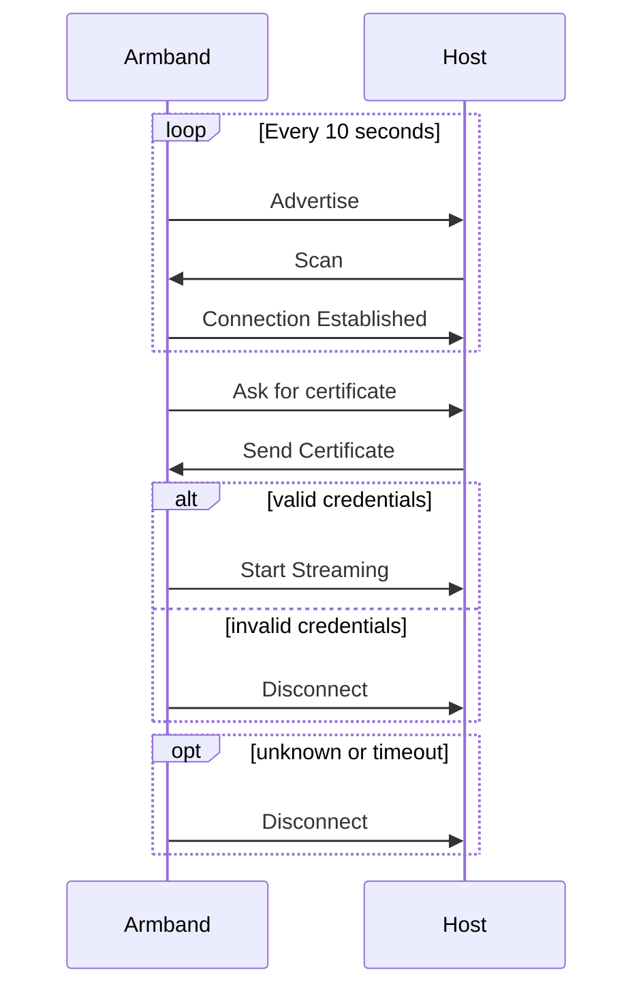
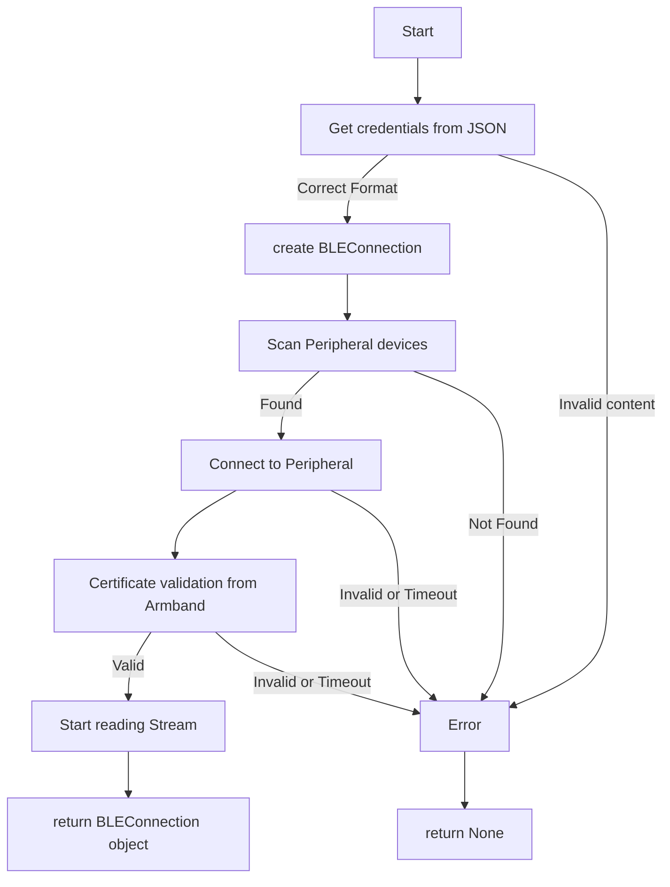

# Connection

## Overview

The Armband has two types of connections: the USB connection and the Bluetooth
connection.

The **Bluetooth connection** is chosen as default, and is used to communicate
with the Armband wirelessly. It is the preferred method for most applications,
as it enables a simpler setup, and more user-friendly interaction with the
Armband.

The **USB connection** offers a direct way of connecting, allowing for a faster
and more reliable exchange of data. Thus, it is the preferred method for most
development applications, as it enables a stable communication channel between
the Armband and the host computer.

## BLE Connection

To make things clearer and closer to the BLE nomenclature we refer to the
Armband as a peripheral device, and the host computer as a central device.

The wireless connection follows the standard BLE protocol to start the
communication between the Armband (peripheral device) and the host computer
(central device), followed by an exchange of credentials to validate the
connection between them.

Only after this validation is completed, the Armband will start streaming data
to the host computer.

BLE connection process:



The credentials for each device are unique and are provided by the Neeno Team
when the device is acquired. They are stored in a JSON file, which is used to
authenticate the connection between the Armband and the host computer.

### neeno.connect

When connecting with Python, the credentials are passed as an argument to the
`connect` function.

This function first reads the JSON file and validates its contents. If they
describe a valid BLE connection, it will create a `BLEConnection` class object,
and asks your host device to start scanning BLE devices in the vicinity.

Once a device is found, the connection is established, and the credentials are
sent to the Armband. If the credentials are valid, the Armband will start
streaming data to the host computer, and the function `connect` will return the
created `BLEConnection` object.



After a successfull connection, you can start using your `BLEConnection` object
to read the streamed data from the Armband.

The attribute `data` of the `BLEConnection` object is a byte array updated
every time new data is received from the Armband.

```python title="simple_ble_connection.py"
import neeno
armband_ble = neeno.connect("credentials.json")
while armband_ble.data_available():
    print(armband_ble.data)
```

This will print the data streamed from the Armband every time new data is
received. We can stop the execution by pressing `Ctrl+C`. This will also
finish the connection with the Armband.

```
$ python simple_ble_connection.py
Connected to '11:22:33:44:55:66'
[ 1.78505900e+07  9.94552487e-01  4.95322942e-02 -5.61040677e-02
 -7.25550608e-02  8.43566331e-01 -1.16930183e-02 -7.00000000e-01
  1.21614716e+00]
[ 1.78505900e+07  9.94552487e-01  4.95322942e-02 -5.61040677e-02
 -7.25550608e-02  8.43566331e-01 -1.16930183e-02 -7.00000000e-01
  1.21614716e+00]
[ 1.78506900e+07  9.88135932e-01  7.26829342e-03 -8.77417694e-02
 -1.25840903e-01  9.05164273e-01  1.01204211e-01 -7.00000000e-01
  1.10219970e+00]
[ 1.78506900e+07  9.88135932e-01  7.26829342e-03 -8.77417694e-02
 -1.25840903e-01  9.05164273e-01  1.01204211e-01 -7.00000000e-01
  1.10219970e+00]
[ 1.78507900e+07  9.94648126e-01 -8.27074411e-02 -2.49536451e-02
 -5.66736335e-02  9.59479700e-01  3.46532403e-02 -7.00000000e-01
  1.33436103e+00]
KeyboardInterrupt
^C
Disconnected from '11:22:33:44:55:66'
```
